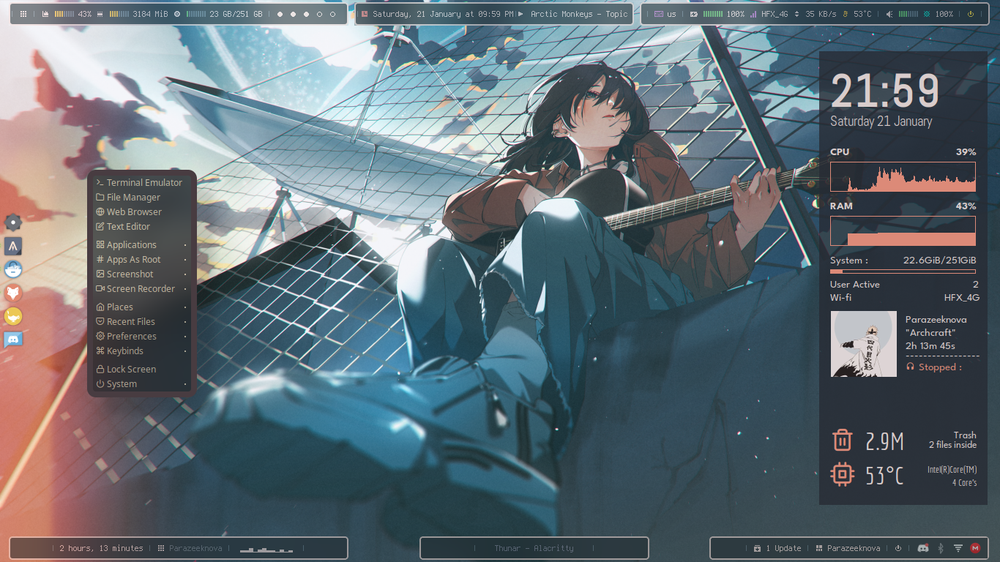

<h1 align="center"> Pistachio V2 Dotfiles 🍚 :</h1>

> ✨ Inspired/fork/edit from ***Bitwise-forest*** theme by [***adi1090x***](https://github.com/adi1090x) and previous rice [***pistachio-dotfiles***](https://github.com/parazeeknova/pistachio-dotfiles) by me.
- 💻 Arch Linux Openbox Configuration by [*parazeeknova*](https://github.com/parazeeknova).
- 📌 Updated version of previous rice due to entire theme structure change in Archcraft .

 Screenshot 🎞️ 

---
## 🚀 Changelog : 
- **Installation** : Just drag and drop few folders (Thanks for new Theming structure in Archcraft)
- **Polybar Bars** : Added more bars for functionality and modules 
- **Base Theme** : Changed base theme from bitwise-forest to everforest 

---

## 🌏 Overview :

- **Operating System** : [`Archcraft`](https://archcraft.io/)
- **Window Manager** : [`Openbox`](http://openbox.org/wiki/Main_Page)
- **Status Bar** : [`Polybar`](https://github.com/polybar/polybar)
- **Widgets** : [`Conky`](https://github.com/brndnmtthws/conky)
- **Launcher** : [`Rofi`](https://github.com/davatorium/rofi)
- **Session Manager** : [`SDDM`](https://wiki.archlinux.org/title/SDDM)
- **Notifications** : [`Dunst`](https://github.com/dunst-project/dunst)
- **Terminal** : [`Alacritty`](https://github.com/alacritty/alacritty)
- **File Manager** : [`Thunar`](https://wiki.archlinux.org/title/thunar) [`Ranger`](https://github.com/ranger/ranger)
- **Compositor** : [`Picom`](https://aur.archlinux.org/packages/picom-ibhagwan-git) 

## 🪜 Installation : 

- **Get the files from** : Here (Soon)
- If you are using _`Archcraft`_ as your OS, You can just replace openbox folder from the dotfile.  
( ***NOTE-FOR-ARCHCRAFT-USER'S*** : This Openbox config only contains Bitwise-forest theme. First ***BACKUP*** your default config to a seperate folder .)
- Install the following programs on your computer: [`cava`](https://github.com/karlstav/cava) [`Zafiro`](https://www.gnome-look.org/p/1209330) [`Phinger-cursors`](https://github.com/phisch/phinger-cursors) 
- After installing programs above, Create openbox directory in **`~/.config`** : `mkdir -p ~/.config/openbox`
- Copy Entire contents of _`openbox`_ to **`~/.config/openbox`** 
- Copy Entire contents of _`openbox-themes`_ to **`~/.config/openbox-themes`** 
- Copy Everything from _`polybar-scripts`_ to **`Home-dir`**
- Copy Everything from _`fonts`_ to **`~/.local/share/fonts/`** 
- Copy Everything from _`conky`_ to **`~/.config/conky/`**
- Copy everforest from _`gtk`_ to **`~/usr/share/themes`**
- Select pistachio form themes menu (Archcraft)

---
| Rofi | Desktop | Terminal | Conky |
| --- | --- | --- | --- |
|||||
---
## 🌟 Credits : 
- [***adi1090x***](https://github.com/adi1090x) ~ For his amazing minimal distro and themes and preconfigured openbox WM .
- [***closebox73x***](https://www.gnome-look.org/u/closebox73x) ~ For his conky themes. 
- [***Polybar-scripts***](https://github.com/polybar/polybar-scripts) ~ For info-cava module.
